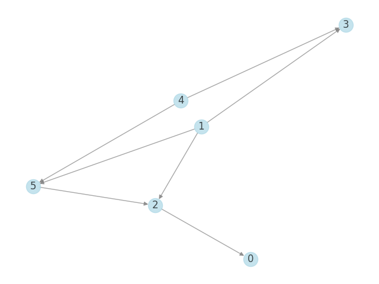

# Graph-Isomorphism
This project implements two basis algorithms for checking isomorphism of two directed acyclic graphs - small DAGs and trees.

# Naive approach
The naive approach is implemented in `naive.py` and it works by checking all possible bijection between two n-sized sets of nodes of two different graphs. Case with different number of nodes or edges is trivial. Since the time complexity of such an approach is `O(n!)`, thus it is only practical for small-sized graphs.

# Tree isomorphism
The script in `trees.py` contains an implementation of an algorithm checking isomorphism of only specific class of graphs - trees. This solution has polynomial time complexity. It assume the edges are directed, for undirected a modification is needed but the time complexity remains the same.
## Isomorphism of rooted trees
For simplicity we can assume that the roots of both trees are known. The algorithm first assigns to every node a distance from root to the node, i.e. the depth. Next, we processes all sets of nodes with the same depth (layer), starting with leaves. Each node in the layer has all its children already processed, thus we encode a multiset of its children with a number unique for each different multiset(those are reused if a multiset has been associated with another node already). With each node in the layer being encoded with a number we can compare the corresponding layers in the two trees. If the both of those layers have the same numbers with the same multiplicities we continue with another layer. Otherwise, the trees are not isomorphic. 
| Example |
|---------|
| |

## Finding roots
If roots of tree are not known they can be found in linear time complexity. In case of directed edges, the root is the node without a parent. Otherwise, it can done by finding the longest path in both trees. The roots are the nodes in the middle. Since there can be two nodes in the middle, isomorphism should be checked for all root combinatoins. Finding roots is implemented but not used, we assume the edges are directed.

# Drawing
Either `draw.py` or `drawApp.py` can be used for drawing the graphs. 
The latter method is recommended since it features simple GUI. Run it with `python3 drawApp.py` and then select a file which you'd like to draw. It should be used with provided test cases, or any other matching their format.
The former takes an input from stdin but only for a single graph, so using tests graph needs taking only a part of a file. Note both graph in those file may have different number of edges. Example use:
`head -n 8 tests/tests_tr0/dag_8_0_t_1.in | python3 draw.py`

| Negative Case #1 (first graph) | Negative Case #1 (second graph) |
|---------|---------|
|  |  |

| Positive Case #1 (first graph) | Positive Case #1 (second graph) |
|---------|---------|
|  |  |

| Negative Case #2 (first graph) | Negative Case #1 (second graph) |
|---------|---------|
|  |  |

| Positive Case #1 (first graph) | Positive Case #1 (second graph) |
|---------|---------|
|  |  |

# Tests
All tests in the tests directory have successfully passed, only few run too long and where stopped during the process (not efficient use of Python).
To repliceate the tests, first zip file in `./tests/` should be uncompresssed. Following tests were run:
`python3 test.py naive.py tests/tests_a`
`python3 test.py naive.py tests/tests_a_dense`
`python3 test.py trees.py tests/tests_tr0`
`python3 test.py trees.py tests/tests_t`
`python3 test.py trees.py tests/tests_t_MORE`. Their results can be found in `./tests/tests.log`. The script `test.py` takes two command line arguments the script for running the test and the data source. Additionally, `./run_all_tests.sh` can be run to automatically decompress and run all cases.

