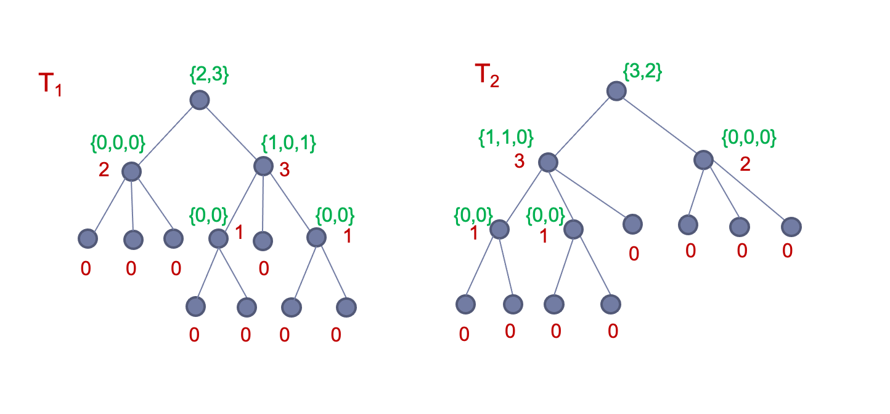

# Graph-Isomorphism

This project implements two basis algorithms for checking an isomorphism of two directed acyclic graphs.

# Naive approach
The naive approach is implemented in naive.py and it works by checking all possible bijection between two n-sized sets of nodes of two different graphs. Case with different number of nodes or edges is trivial. Since the time complexity of such an approach is O(n!) thus it is only practical for small-sized graphs.

# Tree isomorphism
The script in tree.py contains an implementation of an algorithm checking isomorphism of only specific class of graphs - trees. This solution has polynomial time complexity. 
## Isomorphism of rooted trees
For simplicity we can assume that the roots of both trees are known. The algorithm works by assigning a distance from root to any node, i.e. the depth. Next, we processes a set of nodes with the same depth, starting with leaves. Each node in the layer has all its children already processed, thus we encode a multiset of its children with a number unique for each different multiset(those are reused if a multiset has been seen already). With each node in a layer being encoded with a number we can compare the corresponding layers in the two trees. If the both of those layers have the same numbers with the same multiplicities we continue with another layer. Otherwise, the trees are not isomorphic. Such an encoding can be seen in the figure below.

## Finding roots
If roots of tree are not known they can be found in linear time complexity. In tree.py it is done by finding the longest path in both trees. The roots are the nodes in the middle. Since there can be two nodes in the middle, isomorphism should be checked for all root combinatoins.
